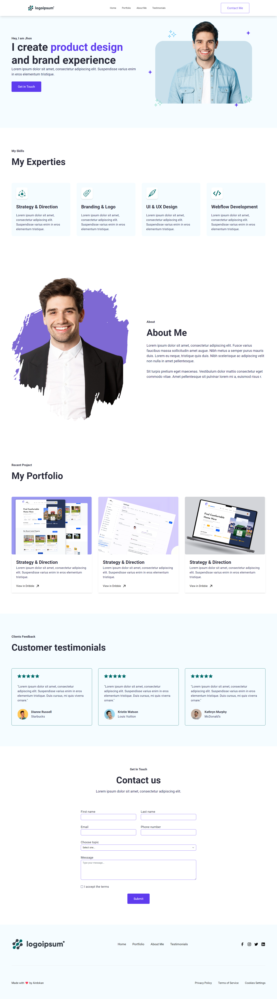

# Portfolio Project Using Tailwind CSS

You will learn here how you can use tailwind css to creat the website faster. This is full bignner course where you will learn Tailwind CSS by developing a Portfolio website.

## Installation

pull master branch of Porfolio-Tailwind-CSS-Project

```bash
  cd tailwind-portfolio
  npm install

```

## Demo



## Authors

- [@codewithpriyesh](https://github.com/codewithpriyesh)

## Tech Stack

**Client:** HTML, JS, TailwindCSS

## 🛠 Skills

Javascript, HTML, CSS...
